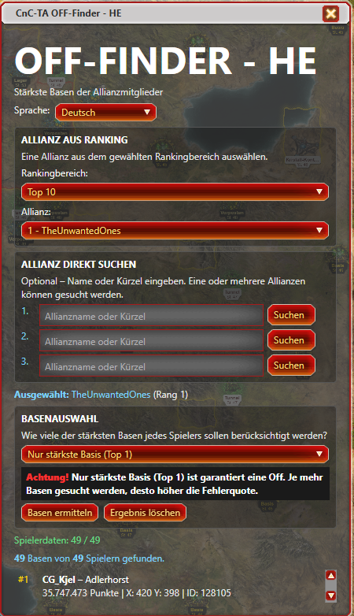
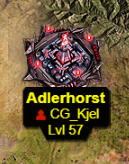

# CnC-TA OFF-Finder – Harzi Edition

Ein Tampermonkey-Userscript für **Command & Conquer: Tiberium Alliances**.

Der **OFF-Finder – HE** sucht die stärksten Basen der Mitglieder einer ausgewählten Allianz und hebt die gefundenen Basen anschließend auf der Weltkarte hervor.

---

## 🔎 Funktionen

- Auswahl einer Allianz über das Allianz-Ranking
- Direkte Suche nach einer Allianz über Name oder Kürzel
- Auswahl des gewünschten Rankingbereichs
- Auswahl, wie viele Basen je Spieler berücksichtigt werden:
  - **Top 1** – nur die stärkste Basis
  - **Top 2** – stärkste und zweitstärkste Basis
  - weitere Top-N-Auswahlen
- Gefundene Basen werden auf der Weltkarte hervorgehoben
- Mehrere Allianzen können gesucht werden
- Suchergebnisse können gelöscht und anschließend neu ermittelt werden
- Einstellungen bleiben gespeichert
- Mehrsprachige Oberfläche:
  - 🇩🇪 Deutsch
  - 🇬🇧 Englisch
  - 🇫🇷 Französisch
  - 🇪🇸 Spanisch

---

## ⚠️ Wichtiger Hinweis zur Basenauswahl

**Nur die stärkste Basis (Top 1) ist garantiert eine Off.**

Je mehr Basen pro Spieler gesucht werden, desto höher ist die Fehlerquote.

Die Auswahl **Top 2, Top 3 usw.** sollte daher nur als zusätzliche Orientierung verwendet werden.

---

## 🖥️ Oberfläche

### Allianz auswählen

Die gewünschte Allianz kann entweder aus dem Ranking ausgewählt oder direkt über ihren Namen bzw. ihr Kürzel gesucht werden.

---

### Basen ermitteln

Nach Auswahl der Allianz kann festgelegt werden, wie viele der stärksten Basen jedes Spielers berücksichtigt werden.

Die gefundenen Basen werden anschließend auf der Weltkarte hervorgehoben.

---

## 📥 Installation

Das Script wird mit **Tampermonkey** installiert.

### Installation über GitHub

Die aktuelle Version kann direkt über das Repository installiert werden:

**CnC-TA OFF-Finder – Harzi Edition**

https://github.com/Harzi66/CnC-TA-Off-Finder-Harzi-Edition

Tampermonkey erkennt die im Script hinterlegte `@downloadURL` und `@updateURL` und kann dadurch zukünftige Versionen automatisch erkennen.

---

## ⚙️ Voraussetzungen

- Mozilla Firefox oder ein kompatibler Browser
- Tampermonkey
- Command & Conquer: Tiberium Alliances

---

## 📌 Version

**Aktuelle Version: 0.1.28**

---

## 👤 Autor

**Harzi**

Harzi's C&C: Tiberium Alliances Userscripts
